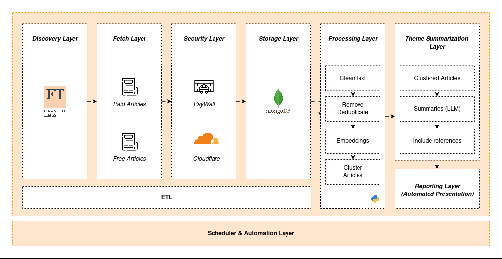

# FT Scraper

**System Architecture:**  


FT Scraper is a Python-based project for automated extraction, transformation, and presentation of web-based content.

---

## Table of Contents

1. [Project Structure](#project-structure)  
2. [Installation](#installation)  
3. [Usage](#usage)  

---

## Project Structure

- `data/embeddings`: Stores text embeddings  
- `data/metadata`: JSON structures and metadata  
- `data/presentations`: Generated PPTX files  
- `ft_scraper/extract`: Fetch and search scripts  
- `ft_scraper/transform`: Data cleaning and preprocessing  
- `ft_scraper/load`: Database loading scripts  
- `ft_scraper/presentation`: Presentation generation  
- `ft_scraper/scheduler`: Scheduled automation tasks  
- `ft_scraper/utils`: Helper functions  

---

## Installation

1. Clone the repository:

```bash
git clone https://github.com/AhmedTioual/ft_scraper.git
cd ft_scraper

python3 -m venv venv
source venv/bin/activate

pip install -r requirements.txt

playwright install

```

## USAGE


```bash
python -m ft_scraper.scheduler.daily_job
